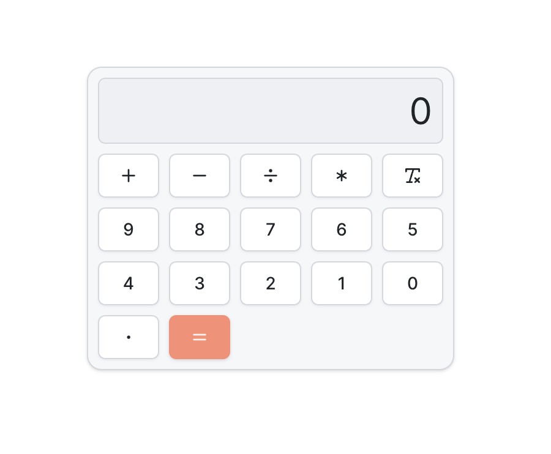

## Nextjs Template Project

> This template has everything you need to get going



Regards, <br />
Luigi Lupini <br />
<br />
I ❤️ all things (🇮🇹 / 🛵 / ☕️ / 👨‍👩‍👧)<br />

## Getting Started

First, run the development server:

```bash
npm run dev
```
